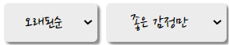
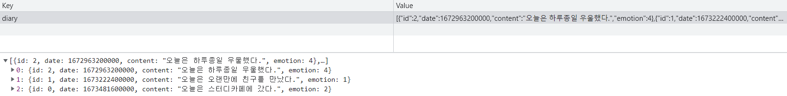
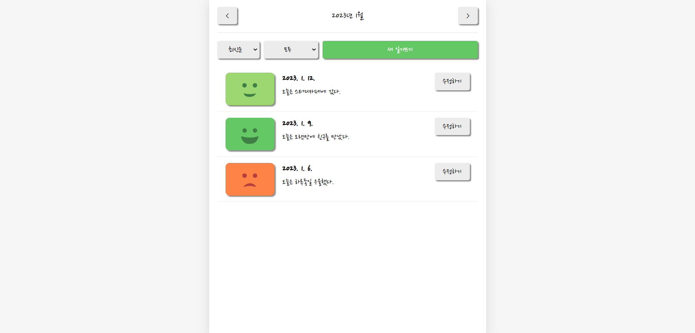
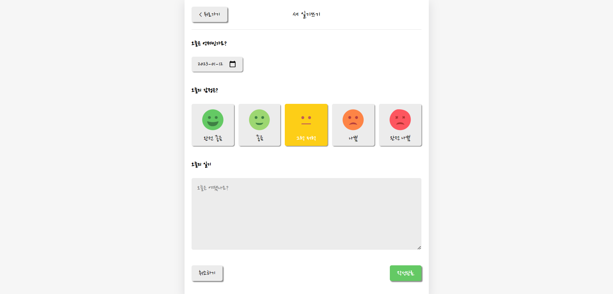
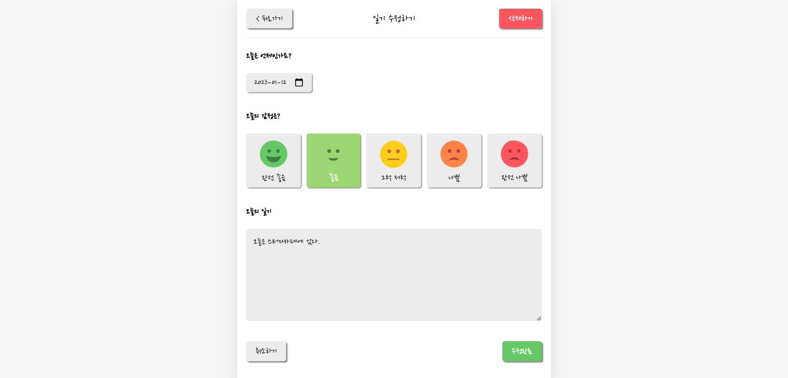
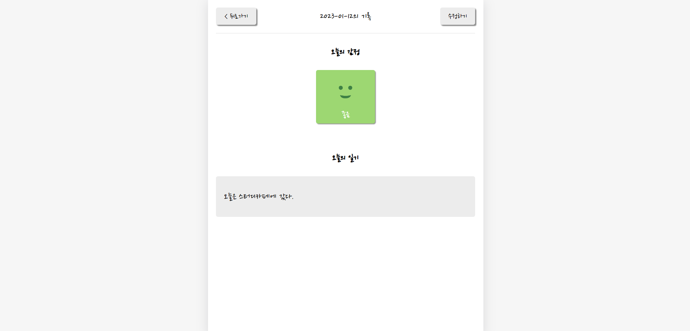

# 📝 emotion-diary 감정 일기장

### ☺️ 오늘의 감정과 함께 하루 일기를 작성해보자 

<br/>

### 🔨 기능
- 일기 작성 / 수정 / 삭제 / 상세
- 감정 기록
- 일기 리스트 정렬 기능 (날짜 / 감정 순) 
  
- Database: **Local Storage** 

### 🔨 기술 스택

---
### Home Page, 일기 리스트


### New Page, 일기 작성


### Edit Page, 일기 수정 + 삭제


### Diary Page, 일기 상세


---


### react-router를 통한 React SPA (Single-Page-Application)

`Router.js`
```
import { BrowserRouter, Routes, Route } from "react-router-dom";

import Home from "./../pages/Home";
import New from "./../pages/New";
import Edit from "./../pages/Edit";
import Diary from "./../pages/Diary";

const Router = () => {
  return (
    <BrowserRouter>
      <div className="App">
        <Routes>
          <Route path="/" element={<Home></Home>}></Route>
          <Route path="/new" element={<New></New>}></Route>
          <Route path="/edit/:id" element={<Edit></Edit>}></Route>
          <Route path="/diary/:id" element={<Diary></Diary>}></Route>
        </Routes>
      </div>
    </BrowserRouter>
  );
};

export default Router;
```

---

#### 🌳 file tree
```
📦src
 ┣ 📂components
 ┃ ┣ 📜DiaryEditor.js
 ┃ ┣ 📜DiaryItem.js
 ┃ ┣ 📜DiaryList.js
 ┃ ┣ 📜EmotionItem.js
 ┃ ┣ 📜MyButton.js
 ┃ ┗ 📜MyHeader.js
 ┣ 📂pages
 ┃ ┣ 📜Diary.js
 ┃ ┣ 📜Edit.js
 ┃ ┣ 📜Home.js
 ┃ ┗ 📜New.js
 ┣ 📂util
 ┃ ┣ 📜date.js
 ┃ ┗ 📜emotion.js
 ┣ 📜App.css
 ┣ 📜App.js
 ┣ 📜index.css
 ┗ 📜index.js
 ```
